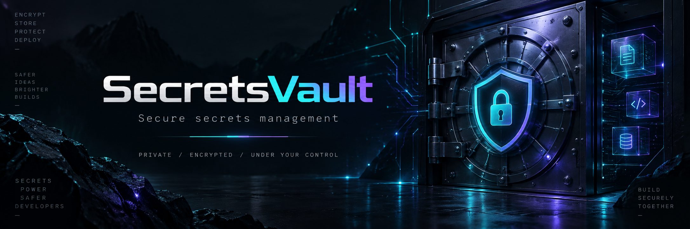
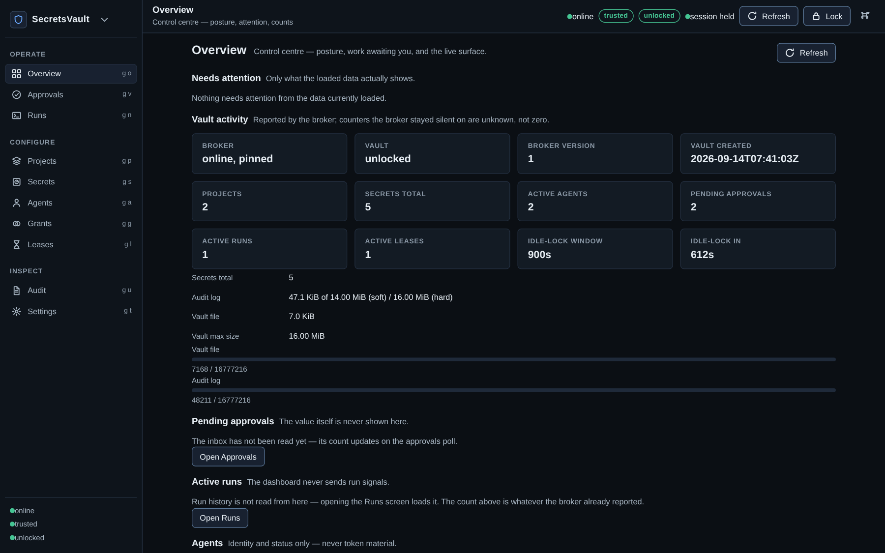
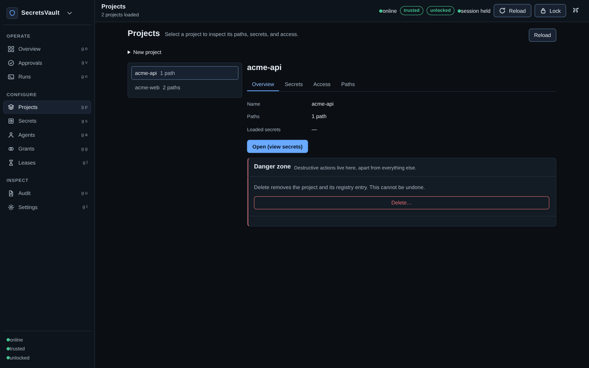
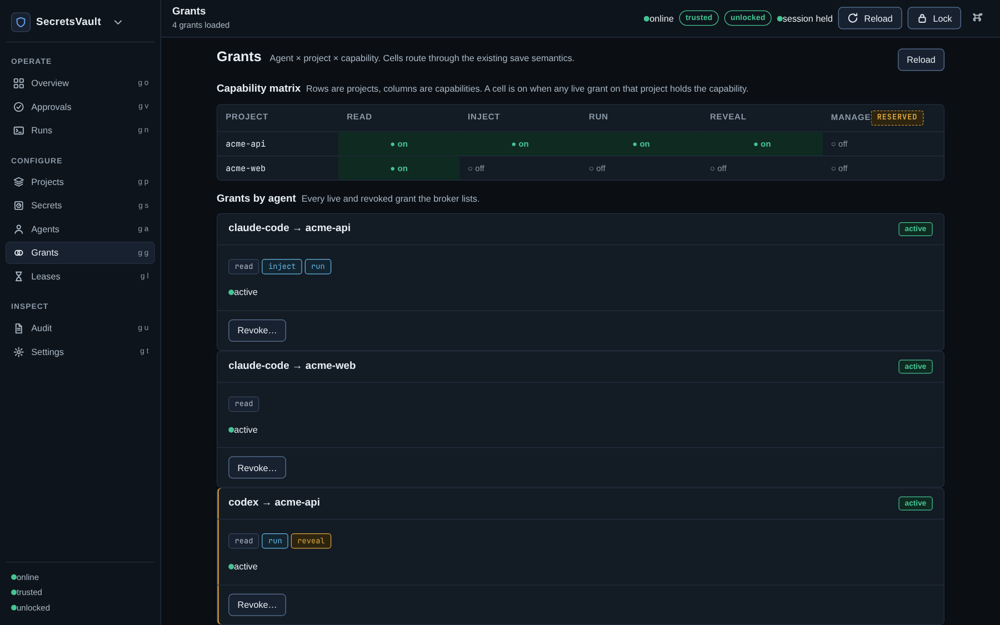
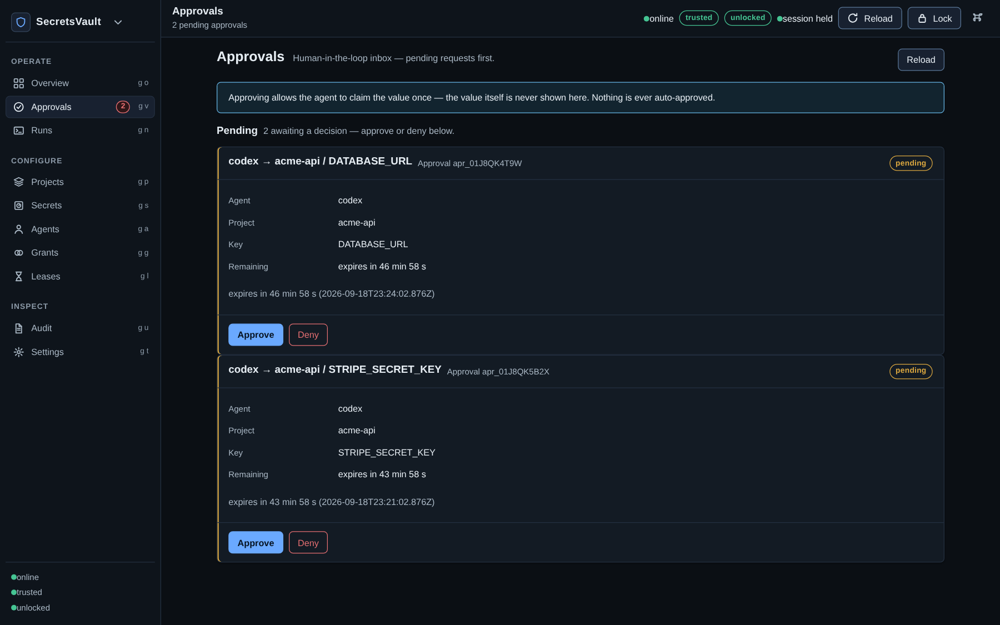
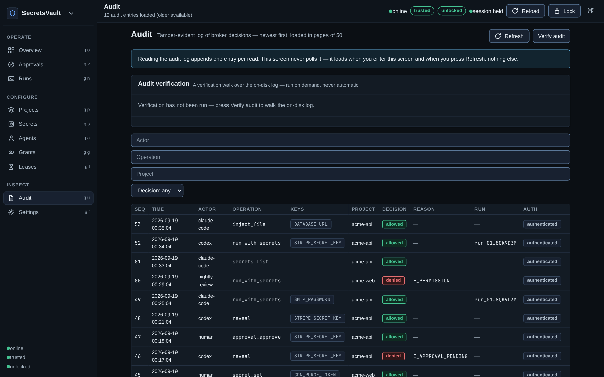

# SecretsVault (`svault`)



SecretsVault is a local secrets broker for AI agents: a daemon on your Linux machine holds encrypted secrets and hands them to agent workflows only through explicit, per-agent, per-project permissions.

**Status: v0.1.0. This project has not received an independent security audit — start with disposable credentials and read `docs/threat-model.md` before storing real secrets.**

## Linux-first, local-first

SecretsVault is built for Linux first. A single local daemon owns the encrypted vault and serves one Unix domain socket (same-user only, peer credentials checked per connection). There is no cloud account, no hosted service, and no network listener — the broker has no TCP surface at all. The CLI, the desktop dashboard, and the MCP adapter are all thin clients of that socket; every authorization decision happens in the broker.

## The problem it solves

Agents need secrets — API keys, tokens, certificates — to do useful work. Today those values are typically pasted into config files, exported into shell environments, baked into container images, or worse, dropped into chat transcripts and logs where they persist forever. Once a secret is in a transcript, it cannot be taken back.

SecretsVault keeps values encrypted at rest and out of agent-visible channels by default. An agent never sees a value unless a human explicitly approved that one read; routine work (listing names, writing config files, running tools) happens without values crossing into the agent's context at all.

## How it works

### Agents and grants

Each agent enrolls with its own token, shown once at enrollment:

```sh
svault agent add bot --write-token-file ~/.config/svault/agents/bot.token
svault grant add bot acme --ops read,inject
```

A grant is a per-agent, per-project capability over `read` / `inject` / `run` / `reveal` / `manage`. Tokens never travel in argv: they are delivered via `--token-fd` (preferred), `--token-file`, or `SVAULT_TOKEN`, in that priority. Agent tokens never unlock the vault, never manage anything, and never approve — management requires the human passphrase, verified against the key slots on every request.

### Approvals: human in the loop

An agent that needs a value calls `reveal`. The first call does not return the secret — it raises a pending approval and answers `E_APPROVAL_PENDING` with an approval id. A human decides at the terminal (**CLI**: `approval pending`, `approval approve <id>`, `approval deny <id>`) or in the dashboard's Approvals inbox. If approved, the agent claims the value exactly once with that approval id; the claim binds agent, project, key, and the `reveal` operation, and the grant is rechecked at claim time. A human reading their own secret at the TTY (`svault reveal <project> <key>`) is a separate direct owner action that needs no approval.

### Leases: narrow, short-lived capabilities

An agent can mint a TTL-bound subset of its own grant: `lease.create {project, ops, ttl_secs}` returns a 256-bit credential exactly once (only its digest and a display prefix persist). Every leased call is evaluated as grant ∩ lease ∩ TTL ∩ unlocked. The public `lease_id` handle authorizes nothing — it exists for listing and revocation only. The MCP adapter holds lease credentials in its own process and substitutes them on the wire, so a capability never appears in a model transcript.

### `inject_file`: secrets into files, without showing them

```sh
svault --token-file ~/.config/svault/agents/bot.token inject acme .env --key STRIPE_KEY
```

The agent names a project and a destination beneath an authorized project folder; the broker writes the secrets itself and returns only the path, the count, and the key names — never values. Destinations are kernel-contained: resolution goes through `openat2` with `RESOLVE_BENEATH | RESOLVE_NO_SYMLINKS | RESOLVE_NO_MAGICLINKS` from a pinned directory handle, so traversal, symlinks, and TOCTOU races are enforced by the kernel, not re-checked by the application. The write is an atomic replace with mode `0600`.

### `run_with_secrets`: spawn the child on the daemon side

```sh
svault --token-file ~/.config/svault/agents/bot.token run acme --key STRIPE_KEY -- /usr/bin/python3 worker.py
```

The broker spawns the child itself with the selected secrets in the child's environment; values never transit the agent process, CLI output, logs, or audit entries. Each run lives in its own process group with bounded cleanup (`SIGTERM`, a short grace period, then `SIGKILL`); revoking the agent or grant, or locking the vault, drains the affected runs. Owned runs can be signaled (`run-signal` with `TERM`, `KILL`, `HUP`, `INT`, or `QUIT`). The working directory is authorized against the project's folders but is directory selection only — not containment (see below).

### Capability summary

| Operation | Needs | Returns |
|---|---|---|
| `secret list` (`secrets.list`) | `read` on the project | Key names + metadata only, never values |
| `inject` (`inject_file`) | `inject` + authorized folder | Path, count, key names only |
| `run` (`run_with_secrets`) | `run` | Child exit status; values stay in the child env |
| `reveal` | `reveal` + human approval | `{value}` exactly once — the only intentional secret-return path |
| `lease create` / `list` / `revoke` | own grant (agents) / human proof | Narrow, expiring capability subset |
| `approval status` | owning agent | `pending \| approved \| denied \| expired \| consumed` |
| everything else (agents, grants, projects, secret set/delete, audit, approvals) | human passphrase per request | — |

## Dashboard

`svault-dashboard` is a desktop UI over the same broker and the same socket — not a bypass. It covers overview, projects, secrets, agents, grants, approvals, leases, runs, audit, and settings: posture counters and attention items, project folders, secret metadata (values stay masked unless the owner explicitly reveals), enrollment and token prefixes, the grant editor, the approvals inbox (approving lets the agent claim once — the value is never shown there), lease listing and revocation, the live-run list, the on-demand audit timeline with chain verification, and lock/session/socket settings.

## MCP: six agent tools, no policy

`svault mcp-serve` is a stateless stdio↔Unix-socket adapter with no authorization logic of its own — it translates framing and forwards each call to the broker, which authenticates, authorizes, audits, and redacts. It exposes exactly six agent-safe tools:

| MCP tool | Broker operation |
|---|---|
| `list_secrets` | `secrets.list` |
| `inject_file` | `inject_file` |
| `reveal` | `reveal` |
| `approval_status` | `approvals.status` |
| `lease_create` | `lease.create` |
| `lease_revoke` | `lease.revoke` |

Human-only operations and `run_with_secrets` / `run_signal` are absent by design: the former need a human decision, the latter needs a file-descriptor contract MCP stdio cannot supply. Point any MCP-compatible harness at `svault mcp-serve` over stdio with the agent token supplied the usual way (`--token-file` / `--token-fd` / `SVAULT_TOKEN`).

## Audit: tamper-evident, with stated limits

Every operation, allowed or denied, appends one entry to an append-only log. Entries form a SHA-256 hash chain, and while the vault is unlocked each entry also carries an HMAC-SHA256 under a key derived from the master key and held in RAM only. Audit entries never carry secret values or token material.

`svault audit show --tail 5` reads recent entries (human only, works while locked); `svault audit verify` walks the chain without a key. What verification proves: that MACed entries are ordered and unmodified, and that checkpointed history has not been truncated (unlock fails closed when the log is behind the vault checkpoint). What it does not prove: entries written while locked carry no MAC and are unauthenticated — truncation or forgery of that tail beyond the checkpoint is not detectable without an external anchor — and a writer holding the MAC key can recompute MACs. A missing entry does not prove a change did not happen; the vault document is the authority on what is authorized, the log on what was recorded.

## Installation

Install the `.deb` package: it provides the `svault` CLI/daemon and the `svault-dashboard` desktop app. Then, at a real terminal:

```sh
svault daemon &    # the dashboard never starts the broker itself
svault trust show  # compare the fingerprint out-of-band, then any interactive
                   # svault command + `yes` pins it (once per socket)
svault init        # first time only
```

On a fresh machine the first interactive command prints the broker fingerprint and asks you to verify it before pinning; anything non-interactive fails closed until a human has pinned once. Full steps, requirements, on-disk layout, and removal are in [`docs/user-install.md`](docs/user-install.md) (removal: [`docs/user-uninstall.md`](docs/user-uninstall.md)).

## Quick start

A complete pass from empty vault to an agent reading one secret (passphrase is always via TTY prompt, never argv):

```sh
svault daemon &
svault init                                       # first time only
svault unlock
svault project add acme --path ~/acme
svault secret set acme STRIPE_KEY                 # value via hidden prompt or piped stdin
svault agent add bot --write-token-file ~/.config/svault/agents/bot.token
svault grant add bot acme --ops read,reveal
svault --token-file ~/.config/svault/agents/bot.token reveal acme STRIPE_KEY
# → approval pending: <approval-id> (expires in 600s)
svault approval approve <approval-id>             # human decides
svault --token-file ~/.config/svault/agents/bot.token reveal acme STRIPE_KEY --approval-id <approval-id>
# → the value, exactly once
svault lock
```

## Screenshots











## What it protects

Short form of `docs/threat-model.md`, which is the authority: secret values never appear in argv, CLI output, broker responses, logs, error messages, or audit entries — the approved `reveal` claim is the single intentional exception. Unlocking needs an interactive TTY passphrase; no agent token can unlock. Management and approvals need that human proof verified on every request. Values are XChaCha20-Poly1305 ciphertext at rest under keys derived through Argon2id; tampering fails closed. File writes and working directories are kernel-contained (`openat2`). Effective capability is re-evaluated per request as grants ∩ lease ∩ lock state, so revocation, grant narrowing, and locking take effect on the next request and drain live runs. The broker exposes no network surface, and clients pin the broker's identity key per socket before sending any credential.

## What it does NOT protect

Read `docs/threat-model.md` before storing real secrets. The limits, without softening:

- A same-user adversary wins: malware running as your user can read process memory, files, and keystrokes. SecretsVault shrinks the window (no plaintext on disk, keys dropped on lock, idle auto-lock) but does not isolate you from your own account.
- Root wins.
- `run` children exfiltrate what they hold: a spawned child is created and controlled by the agent and can read and exfiltrate its own environment. Granting `run` permits use of — and potential exfiltration through — any child it spawns. Revocation and lock stop continued execution but cannot recall copies already taken.
- Injected files are readable by any same-user process; a `run` working directory is directory selection only. There is no sandbox here — containment is the job of the OS sandbox or container, not the broker.
- Agent tokens can leak into agent transcripts (the model can read its own token file). A leaked token grants exactly that holder's existing grants — no escalation — and revocation kills it.
- There is no recovery without the passphrase. Losing it loses the vault.
- The audit log's unauthenticated tail (written while locked) is forgeable, and a writer holding the MAC key can recompute MACs. See above.

## Documentation

- [`docs/user-quickstart.md`](docs/user-quickstart.md) — shortest honest path from zero to working setup.
- [`docs/user-install.md`](docs/user-install.md) — installing from source or package, requirements, on-disk layout.
- [`docs/user-security.md`](docs/user-security.md) — what is protected and what is not, in plain language.
- [`docs/threat-model.md`](docs/threat-model.md) — the security contract: adversaries, invariants, explicit non-guarantees.
- [`docs/protocol.md`](docs/protocol.md) — wire protocol v1: operations, errors, lease/approval flows, MCP mapping.
- [`docs/architecture.md`](docs/architecture.md) — components, trust boundaries, key hierarchy, run execution.
- [`docs/user-troubleshooting.md`](docs/user-troubleshooting.md) — broker trust, lock state, common errors.
- [`docs/user-uninstall.md`](docs/user-uninstall.md) — clean removal.
- [`SECURITY.md`](SECURITY.md) — how to report a vulnerability. **Do not publish live credentials, vault files, tokens, or full audit logs in public issues.**
- [`CHANGELOG.md`](CHANGELOG.md) — release notes.
- [`CONTRIBUTING.md`](CONTRIBUTING.md) — branch model, local gate, release checklist and commit style.

## License

Apache-2.0 — see [LICENSE](LICENSE).
